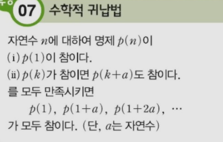

영상: https://www.youtube.com/playlist?list=PLD8rdlfZeJk7ijUM8ckwLLNyDKRD2aQa2

### [명제와 연산자](../이산수학-기초/명제와-연산자.md)

### 추론, 연역법과 귀납법

- ### 추론 (reasoning, inference)
  
  > "참"이라고 알고 있는 명제들로부터 새로운 "참"인 명제를 찾아내는 과정.
  > 
  > `전제(predicate) → 결론(conclusion)`
  > 
  > - 논리(logic): 올바른 추론의 규칙
  
  - #### 연역법 (Deduction)
    
    > If P, then Q 가 참이고, P가 참이면 → Q는 참이다.
    > ⭐ 전제가 참인지!
    
    - 아리스토텔레스의 연역법 예시)
      
      ```
      전제
      All men is mortal. (T)
      Socrates is a man. (T)
      ----------------------
      결론
      Therefore, Socrates is mortal. 
      ```
  
  - #### 귀납법 (Induction)
    
    > 개별적 사실을 말하는 명제들로부터 일반적인 결론을 도출하는 방법.
    > 
    > - `한계`
    >   
    >   현실적으로 집합의 모든 원소들에 대해 참임을 밝힐 수 없다. 고로, 도출된 결론은 확률적인 결론에 불과하다 (likely to be true).
    
    - ##### *수학적 귀납법 (Mathematical Induction)*
      
      > <u>귀납법의 한계를 극복</u>하고, 집합의 모든 원소에 대해 명제가 성립하는 것을 보여준다. 따라서, 모든 경우에 명제가 성립하는 것을 증명할 수 있다.
      > 
      > 

                  

### 논리회로 설계

### [부울 대수(Boolean Algebra)](부울-대수.md)