영상: https://www.youtube.com/playlist?list=PLD8rdlfZeJk6evHY9NsnBqXKrreNbTqFv

### 알고리즘

> 문제를 해결하기 위한 절차를 기술한 것으로,
> 
> - 누구나 정해진 절차대로 실행할 수 있어야 한다.
> 
> - 누구나 동일한 입력값에 대해 절차대로 실행하면 <u>동일한 출력값</u>을 얻을 수 있어야 한다.
> 
> - 일정한 시간 안에 출력값을 구할 수 있어야 한다.

- 알고리즘의 특징
  
  - *순서* 대로 정의된 절차
    
    분명한 순서가 있어야 한다.
    
    한 동작을 실행하면 다음에 실행할 동작이 무엇인지 분명해야 한다.
  
  - *명확성*
    
    모든 동작은 명확하게 정의되어야 한다.
    
    모든 동작은 실행가능해야 한다.
  
  - *반드시 원하는 결과* 가 나와야 한다.
  
  - *일정한 시간*  안에 실행되어야 한다.

- 알고리즘의 기술
  
  - 일상어
    
    but, 문해력이나 가독성이 떨어진다. 알고리즘의 구조적인 특성이 나타나지 않기 때문이다.
    
    → 알기 쉽게 적기:
  
  - 알고리즘의 구조
  1. 순차적 구조 (sequential structure)
  
  2. 분기 구조 (branch)
  
  3. 반복 구조 (repetition)
  
  4. 점프 구조 (jump)
  - 알고리즘 기술법 (구조를 반영하여)
    
    (1) 플로우차트
    
    도표. 복잡한 절차를 표현하기에는 불편함이 있다.
    
    (2) 프로그래밍 언어의 코드
    
    - 특정 언어의 문법을 알아야 함
    
    - 실제 코드 수준으로 자세히 적을 필요는 없다.
    
    (3) <u>Pseudo-code (유사코드)</u>
    
    - 프로그래밍 언어 코드의 전 단계로, 프로그래밍 언어들이 사용하는 구조를 그대로 이용한다.

- 알고리즘의 검증(verification)
  
  - 모든 입력값에 대해 정확한 결과값을 내는지 이론적으로 검증하는 것은 힘들다.
  
  - 귀납법으로 증명 → 수학적 귀납법
    
    몇 가지 사례에 대해 옮음을 보인다:
    
    1) 일반적인 값
    
    2) 특수한 입력값 (boundary condition)
    
    위 방법을 통해 (거의) 맞다고 볼 수 있음.

---

## 그래프

> 그래프 $G$는 다음의 두 집합으로 구성되며 $G = ${$V, E$} 로 표시한다. $V$는 정점(vertex)들의 집합이며, $E$ 는 정점들을 연결하는 선(edge)들의 집합이다.
> 
> 
> 
> - 차수(degree): 정점 $u$에 연결된 연결선의 수. $deg(u)$ 와 같이 표기하기도 함.

### 

### 오일러 순환과 해밀턴 순환

#### 1) 오일러 순환

- 이야기: 쾨니스버그의 다리들
  
  현실의 문제를 모델링 (필요한 정보를 남겨두고 단순화)
  
  ⇒ 그래프 표현
  
  (⇒ 알고리즘)

- 결국 '쾨니스버그의 다리들' 문제는 한붓 그리기 문제와 동일:
  
  오일러라는 수학자가 이 문제에 대한 답을 제시했다.
  
  - 오일러 경로(Eulerian path)
    
    그래프 G 의 모든 <u>연결선</u>을 한 번만 방문하는 경로
  
  - 오일러 순환(Eulerian cycle/circuit)
    
    시작점과 끝점이 동일한 오일러 경로
  
  - 오일러 그래프
    
    오일러 순환이 존재하는 그래프

> **<정리> 오일러 경로를 갖기 위한 필요충분 조건**
> 
> 2개 이상의 정점을 갖는, 루프가 없는 연결 그래프에서<mark>홀수 차수를 갖는 정점이 하나도 없거나, 오직 두 개(시작</mark><mark>점, 끝점)만 존재</mark>해야 한다.
> 
> 특히, <u>모든 정점이 짝수 차수</u>를 가지면 *오일러 순환* 이 존재하며, 이 그래프는 *오일러 그래프* 이다.

※ 오일러 정리의 알고리즘 복잡도

정점의 총 개수 $n$ 개에 대해 각 차수는 최대 $n-1$ 이므로

    알고리즘 복잡도 ≤ $n * (n-1)$ ≤ $n^2$

    ∴ $O(n^2)$

#### 

#### 2) 해밀턴 순환

- 해밀턴 경로(Hamiltonian path)
  
  그래프 $G$ 에서 모든 <u>정점</u>을 정확히 한 번만 지나는 경로

- 해밀턴 순환(Hamiltonian cycle/circuit)
  
  시작점과 끝점이 같은 해밀턴 경로

> (예)
> 
> 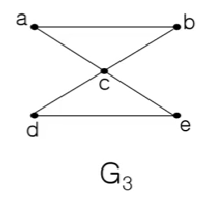
> 
> 해밀턴 순환이 존재하지 않는다. 하지만, 오일러 순환은 존재한다.

- 해밀턴 순환을 찾는 알고리즘은 존재하지 않는다.
  
  모든 경우를 다 해봐야 함: 전수조사(exhaustive search)
  
  ∴ 알고리즘 복잡도 = $x^n$     (정점의 개수 $n$개, 차수 $x$)
  
  ↳ 복잡도 함수가 다항식이 아니라 지수식: 몹시 어려운 문제

- 흔히 '방문 판매원 문제(travelling salesman problem)'이라고 함: TSP 알고리즘
  
  - 연결선에는 비용이 주어진다 (weighted edge).
  
  - 일반적으로 완전 그래프
  
  - 해당 그래프에서 비용이 최소가 되는 해밀턴 순환을 찾는 문제
  
  > (예)
  > 
  > 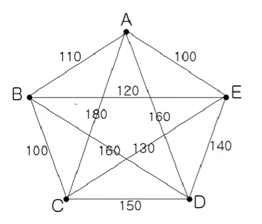
  > 
  > → 
  > 
  > sol 1) 모든 해밀턴 순환을 찾아서 비용이 가장 적은 순환을 선택한다. 즉, 전수조사.
  > 
  > ~~sol 2) 단순 TSP 알고리즘~~
  > 
  > ~~but, 항상 최적의 해를 보장해주지 못함.~~
  > 
  > 1. ~~하나의 정점을 선택하여 출발점으로 한다.~~
  > 
  > 2. ~~이 정점에 연결된 연결선의 비용이 가장 작은 정점을 선택한다.~~
  > 
  > 3. ~~이 정점에서부터 아직 선택되지 않은 정점들 중, 연결선의 비용이 가장 작은 정점을 선택한다.~~
  > 
  > 4. ~~모든 정점을 선택할 때까지 2와 3의 절차를 반복한다.~~

### 

### 기본 용어

**그래프**

> **그래프** G는 다음의 두 집합으로 구성되며 G = {V, E} 로 표시한다. V는 정점(vertex)들의 집합이며, E 는 정점들을 연결하는 선(edge)들의 집합이다.
> 
> - **차수(degree)**: 정점 u에 연결된 연결선의 수. $deg(u)$와 같이 표기하기도 함.
>   
>   ⇒ 그래프에서 <mark>모든 정점의 차수의 합은 모든 연결선 수의 2배</mark>이다.
> 
> - 임의의 연결선 $e=(u, v)$ 에 대해서,
>   
>   정점 $u$ 와 $v$ 는 서로 *인접(adjacent)* 하다고 하며,
>   
>   $e$ 는 정점 $u$ 와 $v$ 에 *접합(incident)* 한다고 말한다.
> 
> - 연결선의 두 끝점이 같은 정점이면 이 연결선을 *루프(loop)* 라고 한다.
> 
> - 두 정점의 연결선이 둘 이상일 때 *다중 연결선* 이라고 한다.
> 
> - **단순 그래프(simple graph)**
>   
>   > 루프나 다중 연결선이 없는 그래프
> 
> - 두 정점 $u$ 와 $v$ 사이에 연결선이 존재하면, 두 정점은 *연결(connected)* 되었다고 한다.
>   
>   모든 정점이 연결되어 있는 그래프를 *연결 그래프*, 아닌 것을 *비연결 그래프* 라고 한다.

> - **길이(length)**
>   
>    두 정점의 경로를 구성하는 연결선의 수
> 
> - **거리(distance)**
>   
>   두 정점 간의 최단 경로의 길이 (= 가장 짧은 길이)
> 
> - **닫힌 경로(closed path)**
>   
>   경로 {$v_1, v_2, ..., v_n$} 에서 $v_1=v_n$ 인 경로
> 
> - **순환(cycle, circuit)**
>   
>   3개 이상의 연결선을 갖는 경로에서 어떤 연결선도 중복되지 않는 닫힌 경로

> - **부분 그래프(sub-graph)**
>   
>   그래프 $G=${$V, E$} 가 있을 때,
>   
>    $V'⊆V$ 이고 $E'⊆E$ 인 그래프 $G'=${$V', E'$} 를 $G$ 의 부분 그래프라고 한다.
> 
> - **동형 그래프(isomorphic graph)**
>   
>   임의의 두 그래프 $G=${$V, E$} 와 $G'=${$V', E'$} 에 대하여 다음의 조건을 만족하는 함수가 $1:1$ 관계의 함수이면, 두 그래프 $G$ 와 $G'$ 를 *동형 그래프* 라고 한다.
>   
>   > 함수 $f: v → v' (v∈V, v'∈V')$
>   > 
>   > $(x, y) ∈ E ⇔ (f(x), f(y)) ∈ E'$
>   
>   그리고 이 관계가 성립하는 함수 $f$ 를 *동형(isomorphic)* 이라고 한다.
>   
>   "즉, 매핑되는 관계에 있다면 동형"
> 
> - **완전 그래프(complete graph)**
>   
>   그래프 $G=${$V, E$} 의 모든 정점 사이에 연결선이 존재하면, $G$ 를 *완전 그래프* 라고 한다.
>   
>   완전 그래프는 $K_m$ 으로 표시한다 ($m$ 은 정점의 총 개수).
> 
> - **이분 그래프(bipartite graph)**
>   
>   그래프 $G=${$V, E$} 의 $V$ 가 $X∩Y=∅$ 인 두 부분집합 $X$ 와 $Y$ 로 갈라지고, 연결선이 $x∈X, y∈Y$ 인 $(x, y)$ 의 쌍으로 이루어지면, $G$ 는 *이분 그래프* 라고 한다. 
>   
>   또한 $X$ 의 모든 정점과 $Y$ 의 모든 정점 사이에 연결선이 존재하면, $G$ 를 *완전 이분 그래프(complete bipartite graph)* 라고 하며, $K_{m,n}$ 으로 표시한다. ($m$ 은 $X$ 의 정점 개수, $n$ 은 $Y$ 의 정점 개수)
>   
>   "즉, 같은 그룹에 속한 정점들 사이에는 연결선이 존재하지 않고 서로 다른 그룹의 정점들 사이에만 연결선이 존재하는 그래프"
>   
>   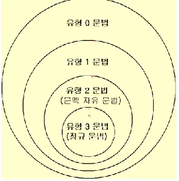
> 
> - **정규 그래프(regular graph)**
>   
>   그래프 $G=${$V, E$} 의 모든 정점의 차수가 같으면,  $G$ 를 *정규 그래프* 라고 한다.
>   
>   - 완전 그래프는 모두 정규 그래프
> 
> - **평면 그래프(planar graph)**
>   
>   그래프 $G=${$V, E$} 의 연결선들이 서로 교차하지 않고 평면 상에 그려질 수 있는 그래프 G 를 *평면 그래프* 라고 한다.
>   
>   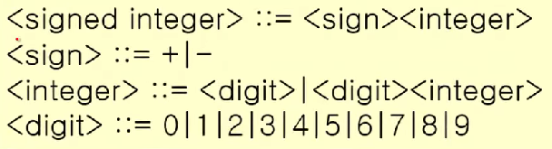
>   
>   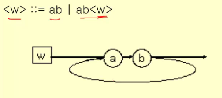
>   
>   - 면(face)
>     
>     > 연결선에 따라 구분된 영역
> 
> - **방향 그래프(directed graph, digraph)**
>   
>   그래프 G={V, E} 에서 연결선의 두 정점이 순서쌍일 때 G 를 *방향 그래프* 라고 한다.

- 문제 - 그래프로 풀어보기
  
  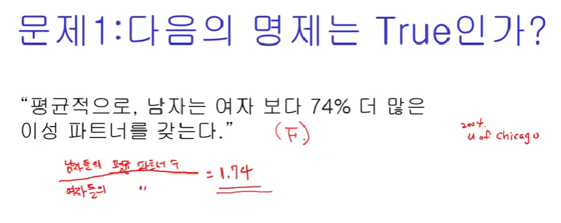
  
  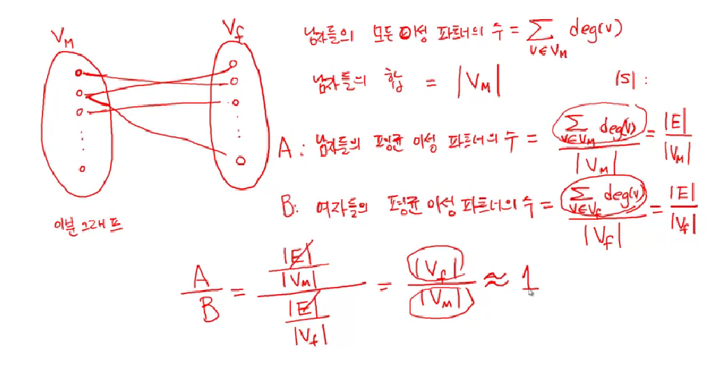

### 

### 그래프 채색

- 문제 1) 주파수 할당

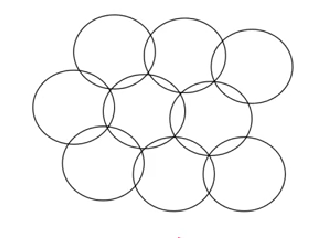

이웃한 셀끼리 같은 주파수를 사용할 수 없을 때, 필요한 주파수 대역의 최소 개수는?

- 문제 2) 시험 스케줄 짜기

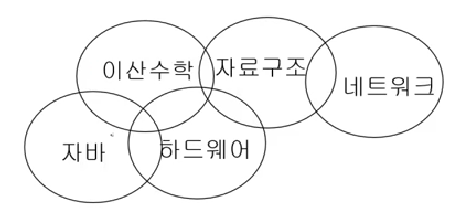

겹치지 않고 시험을 볼 수 있게 하는 방법?

- 문제 3) 지도 색칠하기

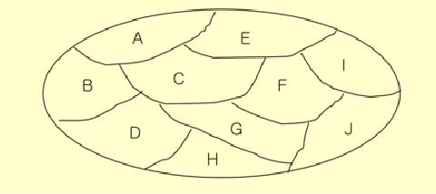

최소 몇 개의 색이 필요한가?

⇒ 위의 세 문제는 모두 같은 문제이다.

각 셀을 노드로 두고, 이웃한 것끼리 연결선으로 이어 그래프 상에 이웃한 것끼리 겹치지 않도록 계산하면 된다.

#### 그래프의 채색(coloring)

> 인접하고 있는 정점들은 서로 다른 색을 갖도록 하면서 그래프의 모든 정점에 색을 할당

#### 색상 수 (chromatic number)

> - 그래프 채색에 필요한 최소한의 색의 수
> 
> - $x(G)$ 로 표시한다.

- 완전 그래프 $K_n$ 의 색상 수는 $n$

- 이분 그래프 $K_{m,n}$ 의 색상 수는 2

#### simple coloring algorithm

1. 모든 정점들의 순서를 정한다: $v_1, v_2, ..., v_n$
   
   - 순서에 따라 최소의 수가 나오기도 하고, 그렇지 않기도 한다.
   
   - (서로 이웃한 점으로 순서가 이어지도록 정하면 최소의 수가 나오는 것 같다.)

2. 모든 색상들의 순서를 정한다: $c_1, c_2, ..., c_n$

3. From $v_1$ to $v_n$
   
   그래프 채색의 조건을 만족하는 색상 중에서 가장 낮은 번호의 색상을 선택하여 $v_i$에 배정한다.

#### Greedy algorithm (탐욕 알고리즘)

> 결정을 할 때마다 최종 결과에 관계 없이 그 순간에서 최선의 선택을 한다.
> 
> - 그 순간의 선택은 그 순간에서 최적의 선택이다 (locally optimal solution).
> 
> - 하지만, 최종의 결과가 최적(global optimal solution)이라는 보장은 없다 .
> 
> - 예) simple coloring algorithm, TSP

- 문제 1) 260원을 다음의 동전들을 사용하여 교환한다면 가장 적은 수의 동전은 몇 개인가: 100원, 50원, 10원?
  
  → 가장 큰 동전부터 최대 개수
  
  **but,** 170원, 100원, 50원, 10원이 되면 최적의 답안이 나오지 않는다.

### 최소신장 트리

#### 신장 트리 (spanning tree)

> 그래프 $G=${$V, E$} 에서 $V$의 모든 정점을 포함하면서 순환(cycle)이 존재하지 않는 부분 그래프(subgraph)를 *신장 트리* 라고 한다.
> 
> 어떤 그래프에서 신장 트리가 유일한 건 아니다.
> 
> 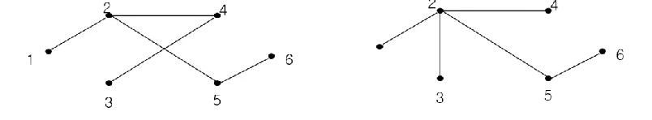

#### 최소 신장 트리 (Minimum Spanning Tree)

> 가중 그래프에서 가중치의 합을 최소로 하는 신장 트리를 *최소 신장 트리* 라고 한다.
> 
> - 최소 신장 트리(MST) 알고리즘
>   
>   - Prim 알고리즘
>   
>   - Kruskal 알고리즘

##### Prim 알고리즘

입력: 그래프 $G=${$V, E$}

출력: 최소 신장 트리 $G^T = ${$V, T$}

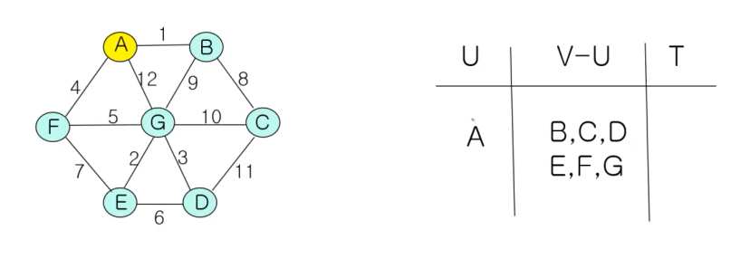

초기값: $T=∅, U=${$s$} ($s ∈V$, 즉 $G$의 임의의 노드)

while ($U ≠V$)

    $u∈U, v∈V-U$ 의 두 정점을 연결하는 모든 연결선 중에서 가장 적은 비용의 연결선 ($u, v$)를 선택한다.

    $T=T∪${($u, v$)}

    $U=U∪${$v$}

> - 그리디 알고리즘의 하나
> 
> - 하지만, Prim 알고리즘은 모든 그래프에 대해서 최적의 해를 구한다.
>   
>   증명)
>   
>   - 연결선 중 비용이 가장 작은 걸 $e$
>   
>   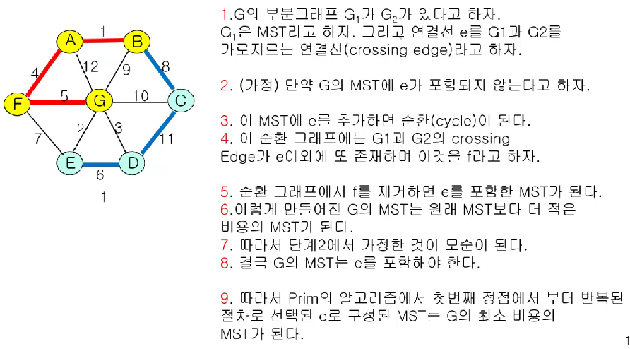
>   
>   (G_1을 A, B, F, G로 된 그래프, G_2를 C, D, E로 된 그래프, e를 선분GE로 보자.)
>   
>   (어렵지만 대충 정리해보자면) MST를 만들어가면서 최소 비용의 연결선인 $e$ 를 더해가면 그 그래프가 결국 MST일 수밖에 없다. 최소 비용의 연결선을 포함해야만 MST가 된다.
> 
> - 복잡도 ≤ $V^2$
>   
>   ∴ $O(V^2)$
>   
>   (사실 알고리즘의 복잡도는 어떤 data structure로 어떻게 구현하느냐에 달려있으므로, 좋은 자료구조로 구현하면 $V*logE$)

##### Kruskal 알고리즘

입력: 그래프 $G=${$V, E$}

출력: 최소 신장 트리 $G^T=${$V, T$}

초기값: $T=∅$

$E$의 모든 연결선을 비용이 적은 순서대로 정렬한다.

while ($T$의 연결선의 수 < $V$의 정점의 수 $- 1$)

    순서대로 정렬된 $E$의 연결선 중에서 차례대로 ($u, v$)를 선택한다. 이때 ($u, v$)는 $T$에 속한 연결선과 순환을 만들지 않는 것이어야 한다.

> 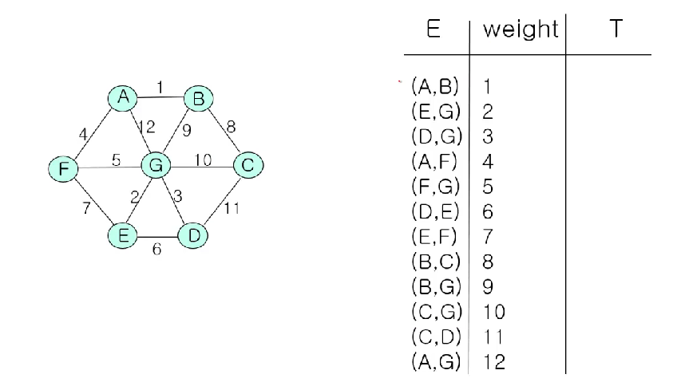
> 
> - 복잡도
>   
>   - 정렬: $E*logE$
>   
>   - 확인:  ≤ $E*V$ (또는 $E*logE$)

### 최단경로 알고리즘 (shortest path algorithm)

i) (노드) 1  → 1

ii) 1 → all ✔

iii) all → all

위의 세 가지 경우로 나누어볼 수 있고, 각각의 경우에 최적의 알고리즘을 찾을 수 있다.

(여기서 보는 건 ii)의 경우)

#### Dijkstra 알고리즘

> - 용례: OSPF 라우팅 알고리즘
> 
> - single-source 최단경로 알고리즘에 속함
>   
>   (하나의 정점에서 다른 모든 정점으로 가는 최단 경로를 찾음)
> 
> - 방향/비방향 그래프 모두 적용
> 
> - 가중치 값이 음수가 아니어야 한다.
> 
> - 복잡도: $O(V^2)$ (구현에 따라 달라짐: $E*logV$)

입력: 그래프 $G=${$V, E, W$}, $V=${$1, 2, 3, ..., n$}

출력: source 1에서 다른 정점으로의 최단 경로와 비용

- $C[i, j]$: 연결선 $e=(i, j)$ 의 비용(가중치)

- $D[i]$: source 1에서 정점 $i$ 까지 경로의 비용

$S=${$1$}

for $i=2$ to $n$

    $D[i] = C[1, i]$    # 1에서 노드 $i$ 까지의 비용

while ($V≠S$)

    $V-S$의 정점 중에서 $D[w]$가 최소값인 정점 $w$를 선택한다.

    $w$를 $S$에 합한다. ($S=S+${$w$})

    for $v∈V-S$     # $S$를 제외한 모든 정점들에 대해서

        $D[v] = min(D[v], D[w] + C[w, v])$

(즉, 각 단계에서 cost가 최소가 되는 정점을 택해서 그 정점을 이용해 더 최단 경로를 계속해서 갱신해나감. 직전의 노드를 기억함으로써 경로 구할 수 있다.)

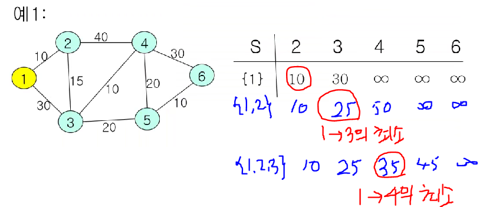

#### Bellman-Ford 알고리즘

> - single source에서 모든 정점까지의 최단 거리 결정
> 
> - 방향/비방향 그래프에 모두 적용
> 
> - 가중치가 음수일 때도 적용 가능
>   
>   하지만, (같은) 순환을 구성하는 연결선의 가중치의 합은 양수여야 한다.
> 
> - 인터넷의 라우팅 프로토콜에서 사용: RIP, BGP

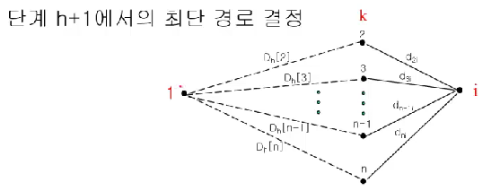

> source로부터 특정 정점에 이르는 경로를 선택할 때,
> 
> 각 단계 $h$마다 최대 $h$ 개의 연결선으로 연결된 경로 중에서 최소값을 갖는 경로를 선택
> 
> $D_h[k]$: $h$ 단계까지 계산 결과  source 1에서 각 정점에 이르는 경로의 최소값
> 
> $d_{ki}$: 연결선 ($k, i$)의 비용
> 
> → $D_h[k] + d_{ki}$ 를 계산하여 최소값 선택
> 
> (직접 연결된 경로에 대해, 그 경로의 비용 + 직전 단계까지의 비용)

입력: 그래프 $G=${$V, E, W$}, $V=${$1, 2, 3, ..., n$}

출력: source 1에서 다른 정점으로의 최단 경로와 비용

[단계 1] 초기화

    $D[1] = 0, D[i] = ∞$ for all $i∈${$2, 3, ..., n$}

[단계 2]

    for all $i∈${$2, 3, ..., n$}

        $D[i] = min(D[k] + d_{ki})$ for $i$ 와 직접 연결선이 있는 $k$

'단계 2'의 절차를 $D[i]$ 의 변화가 더 이상 발생하지 않을 때까지 반복한다.

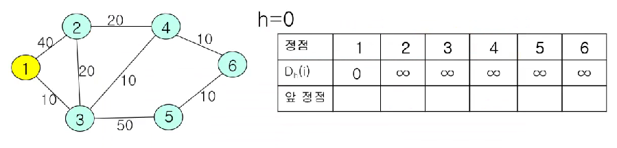

($h$: 반복 횟수)

> 복잡도
> 
> 실제 계산은 매 단계에서 앞 예제의 테이블에 있는 각 정점에 대하여 모든 연결선의 비용을 다시 계산하고 업데이트한다.
> 
> 따라서, $O(V*E)$
