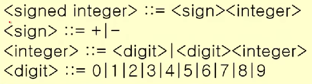
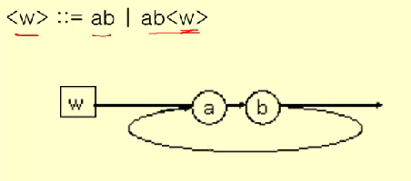

영상: https://www.youtube.com/playlist?list=PLD8rdlfZeJk7aDHa1VxqnX5TyQ4FmgavH

### 형식언어와 문법

- 언어의 구성요소
  
  > 1) (알파벳) 기호들의 집합 $S$
  > 
  > 2) (syntax) $S$ 로부터 문장들의 집합 $S*$ 를 형성하는 규칙
  > 
  > 3) (semantics) 규칙에 합당하게 만들어진 문장들의 의미

#### 형식언어

> - symbol: 기호
> 
> - alphabet: 기호들의 유한 집합
> 
> - string: 알파벳에 포함된 기호들이 나열된 것
> 
> - empty string(공 문자열): 길이가 0인 문자열.  $λ$로 표시. 공집합과는 다르다. 없는 것과는 다르다.
> 
> $V$ 의 기호들은 일정한 규칙에 따라 조합되어 $V*$ 가 되고, 이를 '형식언어'라고 부른다. 규칙은 그 언어의 문법이라고 부른다.

- 구-구문 문법 (phase-structure grammar)
  
  > $G = (V, T, S, P)$
  > 
  > $V$: 기호의 집합 (단말 기호 집합 + 비단말 기호 집합)
  > 
  > $T$: 단말 기호(terminal symbol) (*비단말기호는 '<>' 안에 표현)
  > 
  > $S$: 시작 기호(start symbol, seed)
  > 
  > $P$: 생성 규칙(production rule)('⇒'로 표시)
  > 
  >     If $w ⇒ w'$, $w$ is replaced by $w'$ 
  > 
  >                         (또는 $w$ produces $w'$)
  
  (예) <sentence> ⇒ <noun> <verbphrase>
  
                              ⇒     Jill    <verb><adverb>
  
                              ⇒     Jill    drives  frequently

##### 언어와 문법

<정의> $L(G)$: 문법 $G$ 의 언어.

즉, 문법 $G$ 를 사용하여 만들어질 수 있는 문장들의 집합

#### 문법의 종류 (1)

- 유형0 문법 (비제한 문법): 생성에 아무 제약이 없다.

- 유형1 문법 (문맥 의존 문법; context sensitive grammar)
  
  αAβ ⇒ αθβ
  
  α, β ∈ (N∪T)*, A∈N, θ∈(N∪T) * - {λ}

- 유형2 문법 (문맥 자유 문법; context free grammar)
  
  A ⇒ α, A∈N (비단말 기호), α∈(N∪T)*

- 유형3 문법 (정규 문법; regular grammar)
  
  A ⇒ aB 혹은 A ⇒ a 혹은 A ⇒ λ
  
  A, B ∈N, a∈T

(유형2, 3은 좌변에 비단말기호 하나만, 유형1은 좌변에 여러 개의 비단말기호가 나올 수 있다.)

(유형3은 우변의 형태 제한, 유형2는 우변의 형태 제한 없음)

(유형1은 유형0과 달리 비단말기호가 좌우의 기호와 연관되어서 변화할 수 있음)

#### 문법의 표현

- BNF (Backus-Naur Form) 형식
  
  (1) 비단말 기호는 `<a>`로 표시한다.
  
  (2) 생성 ⇒ 은 `::=`로 표시한다.
  
  (3) 하나의 비단말 기호로부터 생성되는 여러 개의 문자열은 `|`로 구분한다.
  
  

- 문법 다이어그램 (syntax diagram)
  
  (1) 비단말 기호는 사각형으로, 단말 기호는 원으로 그린다.
  
  (2) 생성 과정은 화살표로 표시한다.
  
  (3) 하나의 비단말 기호로부터 생성되는 여러 개의 문자열은 병렬로 놓고 화살표로 표시한다.
  
  

- 유도 트리 (derivation tree)

### 정규식과 정규문법

-

### 유한상태기계

-

### 오토마타와 언어

오토마타

계산 능력이 있는 추상 기계와 그 기계를 이용해서 풀 수 있는 문제들을 연구하는 분야  
형식 언어를 정의하는 관점에서 컴파일러에서 구분 분석을 하면서 추상 구문 트리를 생성할 때  
계산 능력을 가진 추상 기계를 논하는 관점에서 계산 이론적으로 P-NP문제와도 연관성 있음

### 스트링 매칭 알고리즘

-

### 셈(순열과 조합) - 곱의 법칙과 합의 법칙

-
